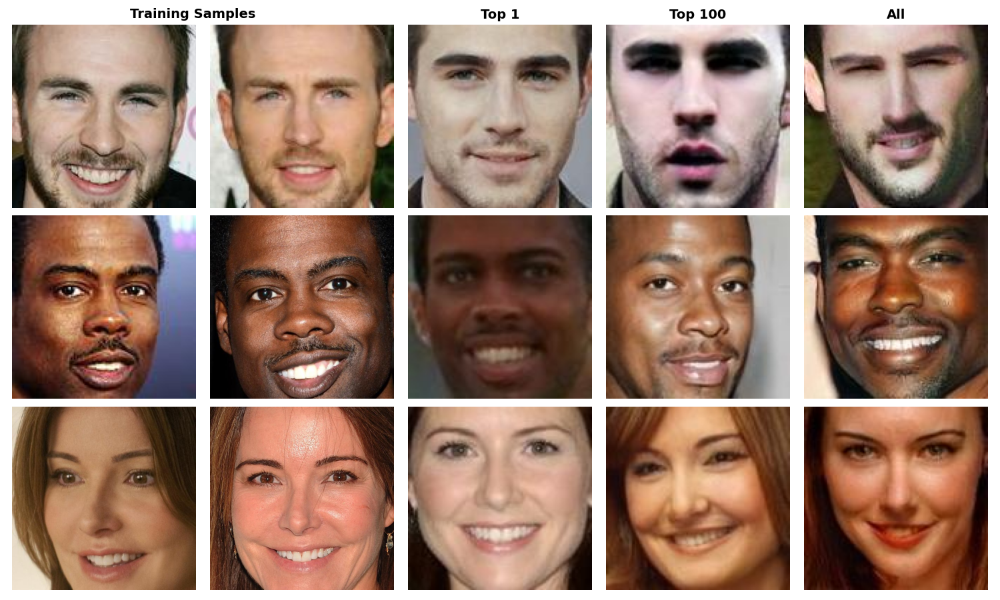

# Description

This code is based on the paper *"Z. Ye, W, Luo and M. L. Naseem, et al., C2FMI: Corse-to-Fine Black-box Model Inversion Attack", TDSC, 2023.*

This code is modified and adapted on the repository [2022YeC2FMI](https://github.com/MiLabHITSZ/2022YeC2FMI). That repository did not implement the option to only use the top-x prediction scores for the attack, althrough the paper did mention that they experimented with it and also showed figures of it. This code implements that feature too. For evaluation (and for the pretrained target model) the [FaceScrub](https://www.kaggle.com/datasets/rajnishe/facescrub-full) dataset was used.

# Results

The figure below shows two samples from the training dataset and three reconstructed images for every label. The reconstructed images use the top 1, top 100 and all of the prediction scores in respective order. 

During my experimentations I observed overall a top-5 accuracy of nearly 1.0, over 0.6 attack accuracy and over 0.4 average confidence. The images above have 0.6 attack, 1.0 top-5 accuracy and 0.43, 0.5, 0.72 average confidence using all, top-1 and top-100 predictions respectively.

# Method description

## Overview

The inversion attack implemented is a two-stage process that uses a pre-trained GAN to generate synthetic images and iteratively optimizes the latent space to match the target label's features. The attack is designed to work in a black-box setting, where only the output probabilities or logits of the target model are accessible.

## Components

**Target Model:**
- The target classifier is with backbone MobileNet and was trained on dataset FaceScrub.
- The goal is to reconstruct identities from the FaceScrub dataset, rather than specific images.

**Generative Adversarial Network (GAN):**
- A pre-trained GAN is used to generate synthetic images from latent vectors.
- The GAN's generator maps latent vectors to high-quality images.

**Embedding Model:**
- A pre-trained embedding model is used to extract feature representations of images.
- These features are compared with the target label's features to guide the optimization process.

**Predict-to-Feature Model:**
- A mapping model (predict2feature) that converts the target model's predictions into feature space.
- This helps align the generated images with the target label's features.

## Attack Workflow

### Stage I: Latent Space Optimization

1. **Initialization:**
    - A batch of latent vectors is initialized based on the mean and standard deviation of the GAN's latent space.

2. **Image Generation:**
    - The latent vectors are passed through the GAN's generator to produce synthetic images.

3. **Prediction and Feature Extraction:**
    - The generated images are resized and passed through the target model to obtain predictions.
    - The predictions are converted into feature space using the predict2feature model.

4. **Loss Calculation:**
    - The generated images are also passed through the embedding model to extract their features.
    - A Mean Squared Error (MSE) loss is computed between the embedding model's features and the target label's features.

5. **Optimization:**
    - The latent vectors are updated using gradient descent to minimize the MSE loss.
    - This process iteratively refines the latent vectors to generate images that better match the target label.

### Stage II: Differential Evolution (DE) Optimization

1. **Population Initialization:**
    - The optimized latent vectors from Stage I. are used to initialize a population for the DE algorithm.

2. **Evolutionary Optimization:**
    - The DE algorithm iteratively refines the population by generating new candidates through mutation and crossover.
    - Fitness is evaluated based on the target model's confidence in the target label.

3. **Image Selection:**
    - The best latent vector from the final population is used to generate the reconstructed image.

# Requirements

Tested on:

- PyTorch 2.5.1
- CUDA 12.1

# How to setup and run

1. download `checkpoint2.zip` from <https://huggingface.co/MiLab-HITSZ/C2FMI/tree/main>.
2. download `trained_models.zip` from <https://huggingface.co/MiLab-HITSZ/C2FMI/tree/main>.
3. unzip and put these 2 folders in your project directory.
4. install the required libraries using `requirements.txt`.
5. run with this command:
> python main_attack.py

- note that you should create directory `gen_figures/DE_facescrub/` in your project before running since our code does not automatically generate it.
- changing the variables `init_label` and `fina_label` in `main_attack.py`, attack will start at `init_label` and end at `fina_label`.
- changing the variable `top_x` in `main_attack.py` to any value less than or equal to the total number of classes makes the attack use only the specified number of prediction scores from the highest ones.

# How to evaluate

### The following command can be run to evaluate the attack accuracy:
> python eva_accuracy.py

- The modification of the annotated variables in `eva_accuracy.py` may be needed depending on file structure and the number of images to evaluate.
